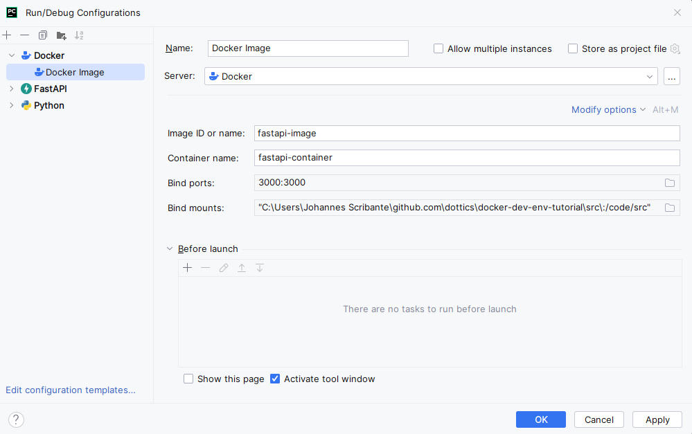

# Docker Env
> References:
> [YouTube: Patrick Loeber](https://www.youtube.com/watch?v=0H2miBK_gAk)

In this example we assume this is a single isolated app that does not need
access to any other services such as a database or other local services that
need to be started by the developer/engineer.

> **Example**
> 
> We are going to create a simple single FastAPI server in a docker environment.

## The FastAPI Server

All we need to get this very simple FastAPI server up and running is the small
code snippet below.

```python
# <root>/src/main.py
from fastapi import FastAPI

app = FastAPI()


@app.get('/')
def read_root():
	return {'message': 'hello'}

```

with python environment requirements saved in the `requirements.txt` file as
```text
# <root>/requirements.txt
uvicorn
fastapi
```

## Dockerfile

```dockerfile
# <root>/Dockerfile
FROM python:3.10-slim

# starting directory
WORKDIR /code

# install all the requirements
# the installation can be cached
COPY ./requirements.txt ./
RUN pip install --no-cache-dir -r requirements.txt

# copy the code
COPY ./src ./src

# entry command
# we run the server on port 0.0.0.0
CMD ["uvicorn", "src.main:app", "--host", "0.0.0.0", "--port", "3000", "--reload"]
```

**host 0.0.0.0**: In practical terms, when a network service is configured to
listen on IP address 0.0.0.0, it means that the service is accessible to any
client that can reach the machine on which the service is running. This can be
useful in situations where the exact IP address of a machine may be unknown or
may change frequently, such as in cloud computing environments.

It's important to note that using 0.0.0.0 as a host address does not mean that
the service is accessible from outside the local network. Network security
measures such as firewalls and access control lists are still necessary to
restrict access to the service as needed.

### Using volumes

## build the image

we build our docker image with the following command.

```bash
docker build -t fastapi-image .
```

## run the container

Just to run our container all we need to do is run the following docker command.

```bash
docker run --name fastapi-container -p 3000:3000 -d fastapi-image
```

### mount your code

Now we mount our code using the docker volumes. 

```bash
docker run --name fastapi-container -p 3000:3000 -d -v $(pwd):/code fastapi-image
```

On windows 

```powershell
docker run --name fastapi-container -p 3000:3000 -d -v ${PWD}:/code fastapi-image
```

This is great since our code is now running on a localized and isolated
development environment in docker, and we are able to update all the code.

However, we now have an issue, where our IDE thinks that we have not yet
installed any of the dependencies/packages and have no development environment
thus we loose all the functionality from code completion.

### setup pycharm environment

Go to settings then `Project > Python Interpreter` then select add interpreter
and choose `On Docker`. Now there are two options:

1. If we had not yet build our docker image then we would choose `Build`.
2. However, since we have already built our image, we can simply choose the
    `Pull or use existing` and specify our image name, in this case it is
    `fastapi-image`, which will assume `image-name:tag` as 
    `fastapi-image:lastest`.

### Run the application

To be able to run the code in a docker container go to
`Run/Debug Configurations`, click the `+` to add a new run environment.

Click on the `Docker > Docker Image` to select an image to run the application
from. 



### Using docker compose

To simplify the process even more we use a docker compose yaml file to ease the
setup process.

```yaml
# <root>/docker-compose.yml
services:
  app:
    build: .
    container_name: python-server
    command: uvicorn src.main:app --host 0.0.0.0 --port 3000 --reload
    ports:
      - 3000:3000
      - 5678:5678
    volumes:
      - .:/code
```

And we are ready to go, to start our containers we simply run the command

```bash
docker compose up
```

Now we extend the yaml file to include redis.

```yaml
# <root>/docker-compose.yml
services:
  app:
    build: .
    container_name: python-server
    command: uvicorn src.main:app --host 0.0.0.0 --port 3000 --reload
    ports:
      - 3000:3000
      - 5678:5678
    volumes:
      - .:/code
    depends_on:
      - redis
  
  redis:
    image: redis:alpine
```

And that is all we need to add a new redis service to our docker compose,
however, now we need to add the dependency to out `requirements.txt` file which
now looks like this.

```python
from fastapi import FastAPI
import redis

app = FastAPI()

r = redis.Redis(host='redis', port=6379)


@app.get('/')
def read_root():
	return {'message': 'hello redis'}


@app.get('/hits')
def read_hits():
	r.incr('hits')
	return {'number of hits': r.get('hits')}

```

And we update the requirements.txt dependencies file

```text
# <root>/requirements.txt
uvicorn
fastapi
redis
```

Now we need to rebuild out image

```bash
docker build -t fastapi-image .
```

and container and to do this we use the
following docker command.

```bash
docker compose up --build
```

Now we can also run this in the detached mode.

```bash
docker compose up --build -d
```